# Sağlık Verileri Üzerinde Klasik–Kuantum Makine Öğrenmesi: Çapraz-Bağlam Karşılaştırmalı Bir Çalışma

[](https://www.python.org/)
[](https://pennylane.ai/)
[](https://pytorch.org/)
[](https://scikit-learn.org/)
[](LICENSE)
[](#)

> **ISADES 2026 — International Symposium on Applied Data Engineering and Sciences** sempozyumuna sunulan makalenin tüm kodları, deney protokolleri ve analiz betikleri.

Bu çalışma, kuantum makine öğrenmesinin (QML) sağlık sınıflandırma görevlerindeki performansını **iki kontrastlı veri seti** üzerinde sistematik olarak değerlendirmektedir: **Wisconsin Breast Cancer Diagnostic (WBCD)** (ikili, %100 gerçek) ve **Estimation of Obesity Levels** (yedi-sınıflı, %77 SMOTE ile sentetik).

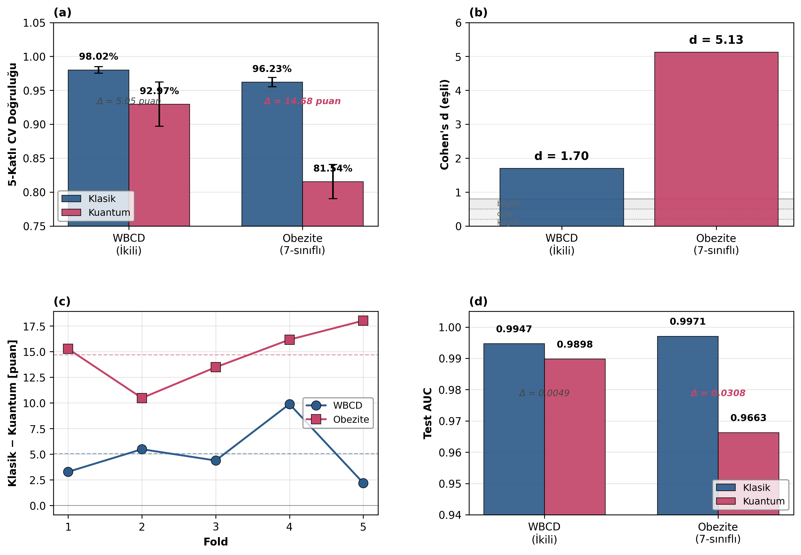

*WBCD'de klasik–kuantum doğruluk farkı yalnızca **5.05 puan** (Cohen's d = 1.70) iken, obezite veri setinde bu açıklık **14.68 puan**'a (Cohen's d = 5.13) yükselmektedir. Wilcoxon signed-rank testi her iki veri setinde p = 0.0312 ile klasik üstünlüğü doğrular.*

---

##  İçindekiler

- [Çalışmanın Özeti](#-çalışmanın-özeti)
- [Anahtar Bulgular](#-anahtar-bulgular)
- [Repo Yapısı](#-repo-yapısı)
- [Kurulum](#-kurulum)
- [Kullanım](#-kullanım)
- [Veri Setleri](#-veri-setleri)
- [Modeller](#-modeller)
- [Görseller](#-görseller)
- [Sonuçlar](#-sonuçlar)
- [Atıf](#-atıf)
- [Yazarlar](#-yazarlar)
- [Lisans](#-lisans)

---

##  Çalışmanın Özeti

Çalışma, QML modellerinin yapısal olarak farklı iki sağlık sınıflandırma görevindeki davranışını ortak bir 5-katlı stratified çapraz doğrulama protokolü altında **35 model varyantı** (16 WBCD + 19 obezite) üzerinden karşılaştırır. Önerilen başlıca yöntemsel katkılar:

1. **Çapraz-bağlam değerlendirme protokolü** — QML'in klasik baseline'lara karşı performans açıklığının veri seti karakteristiklerine göre nasıl değiştiğini ölçer
2. **Q-Hybrid-Q3-Plus mimarisi** — Re-uploading (6 qubit, 2 blok) + Amplitude (4 qubit, 2 katman) çift-kollu hibrit yapısı; obezite görevinde saf kodlamaların %19.7 puan üzerine çıkararak %81.54 doğruluğa ulaşır
3. **Encoding aile ablasyonu** — Angle, IQP, Amplitude, Re-uploading ailelerinin qubit sayısı ve derinlik kombinasyonları altında sistematik taranması
4. **Gürültü robustluğu analizi** — Depolarizing ve bit-flip kanalları altında p ∈ [0, 0.20] aralığında dayanıklılık testleri

---

##  Anahtar Bulgular

| Boyut | WBCD | Obezite |
|-------|:----:|:-------:|
| Sınıflandırma türü | İkili | 7-sınıflı |
| Örnek sayısı | 569 | 2 087 |
| Veri kaynağı | %100 gerçek | %77 SMOTE |
| **Klasik şampiyon** | SVM-RBF | XGBoost-Top10 |
| Klasik CV doğruluğu | **0.9802 ± 0.0044** | **0.9623 ± 0.0061** |
| **Kuantum şampiyon** | VQC ReUpload-6q-3blok | Q-Hybrid-Q3-Plus |
| Kuantum CV doğruluğu | **0.9297 ± 0.0292** | **0.8154 ± 0.0227** |
| **Doğruluk farkı** | **5.05 puan** | **14.68 puan** |
| **Cohen's d (eşli)** | **1.70** (büyük) | **5.13** (çok büyük) |
| **Wilcoxon p (tek-yönlü)** | **0.0312*** | **0.0312*** |

Detaylı sonuçlar için → [Sonuçlar](#-sonuçlar) bölümü

---

##  Repo Yapısı

```
QML-Health-ISADES2026/
│
├── notebooks/                          # Tüm deney notebook'ları
│   ├── QML_BreastCancer_ISADES2026.ipynb       # WBCD ana notebook
│   ├── QML_Obesity_ISADES2026.ipynb            # Obezite ana notebook
│   ├── obesity_classical_models.ipynb          # Obezite klasik baseline
│   ├── obesity_quantum_models.ipynb            # Obezite saf kuantum
│   └── obesity_hybrid_quantum.ipynb            # Q-Hybrid-Q3-Plus ablasyonu
│
├── figures/                            # Makale ve README görselleri
│   ├── banner_capraz_baglam.png        # Anahtar görsel (4-panel)
│   ├── wbcd/                           # WBCD görselleri
│   │   ├── roc_curves.png
│   │   ├── encoding_heatmap.png
│   │   ├── quantum_champion_cm.png
│   │   └── noise_robustness.png
│   ├── obesity/                        # Obezite görselleri
│   │   ├── q3plus_confusion_matrix.png
│   │   ├── reupload_ablation.png
│   │   ├── encoding_families.png
│   │   └── all_quantum_models.png
│   ├── shap/                           # SHAP açıklanabilirlik
│   │   ├── combined_shap.png
│   │   
│   └── stats/                          # İstatistiksel testler
│       └── wilcoxon_folds.png
│
├── results/                            # Sayısal sonuç dosyaları (JSON/CSV)
│   ├── wbcd/
│   │   ├── classical_models.json
│   │   ├── quantum_models.json
│   │   └── noise_spectrum.json
│   └── obesity/
│       ├── classical_models.json
│       ├── quantum_models.json
│       ├── wilcoxon_test.json
│       └── shap_xgboost.json
│
├── data/                               # Veri set bilgileri
│   └── README.md                       # Veri setlerine erişim talimatları
│
├── docs/                               # Ek dökümantasyon
│   ├── METHODOLOGY.md                  # Detaylı yöntem açıklamaları
│   └── HYPERPARAMETERS.md              # Tüm modellerin hiperparametreleri
│
├── requirements.txt                    # Python bağımlılıkları
├── LICENSE                             # MIT lisansı
└── README.md                           # Bu dosya
```

---

##  Kurulum

### Gereksinimler

- Python 3.11 veya üzeri
- 8 GB+ RAM (kuantum simülasyonlar için)
- (Opsiyonel) GPU — yalnızca XGBoost hızlandırma için

### Adım 1: Repoyu klonlayın

```bash
git clone https://github.com/QML-Health/QML-Health-ISADES2026.git
cd QML-Health-ISADES2026
```

### Adım 2: Sanal ortam oluşturun

```bash
python -m venv venv
source venv/bin/activate          # Linux/macOS
# veya
venv\Scripts\activate             # Windows
```

### Adım 3: Bağımlılıkları yükleyin

```bash
pip install -r requirements.txt
```

`requirements.txt` içeriği:
```
pennylane==0.39.0
torch==2.4.0
scikit-learn==1.5.0
xgboost==2.1.0
shap==0.46.0
imbalanced-learn==0.13.0
matplotlib==3.9.0
seaborn==0.13.2
pandas==2.2.0
numpy==1.26.4
jupyter==1.0.0
```

---

##  Kullanım

### Google Colab ile (Önerilen — kuantum simülasyonlar GPU gerektirmez)

Notebook'ları doğrudan Colab'da açıp çalıştırabilirsiniz:

| Notebook | Çalışma süresi | Açıklama |
|----------|:--------------:|----------|
| `QML_BreastCancer_ISADES2026.ipynb` | ~45 dk | WBCD: 6 klasik + 10 kuantum model |
| `QML_Obesity_ISADES2026.ipynb` | ~120 dk | Obezite: tüm fazlar + Wilcoxon |
| `obesity_hybrid_quantum.ipynb` | ~30 dk | Q-Hybrid-Q3-Plus ablasyonu |

### Yerel makinede

```bash
jupyter notebook notebooks/
```

### Sonuçları yeniden üretmek için

```python
# Tüm rastgelelik tohumları sabitlenmiştir
RANDOM_STATE = 42
np.random.seed(42)
torch.manual_seed(42)
```

5-katlı CV bölünmeleri `StratifiedKFold(n_splits=5, shuffle=True, random_state=42)` ile yeniden üretilebilir.

---

##  Veri Setleri

### 1. Wisconsin Breast Cancer Diagnostic (WBCD)

- **Kaynak:** [UCI Machine Learning Repository](https://archive.ics.uci.edu/dataset/17/breast+cancer+wisconsin+diagnostic)
- **Atıf:** Wolberg, W. H., Street, W. N., & Mangasarian, O. L. (1995). *Breast Cancer Wisconsin (Diagnostic) Data Set*. UCI Machine Learning Repository.
- **Örnek sayısı:** 569
- **Öznitelik sayısı:** 30 (sürekli)
- **Sınıf dağılımı:** Malign (37.3%) / Benign (62.7%)
- **Erişim:** `sklearn.datasets.load_breast_cancer()` ile doğrudan yüklenebilir

### 2. Estimation of Obesity Levels Based on Eating Habits and Physical Condition

- **Kaynak:** [Data in Brief (Palechor & De la Hoz Manotas, 2019)](https://doi.org/10.1016/j.dib.2019.104344)
- **Örnek sayısı:** 2 087 (485 orijinal + 1 602 SMOTE)
- **Öznitelik sayısı:** 16 (8 sayısal + 8 kategorik)
- **Sınıf sayısı:** 7 (Yetersiz Kilolu, Normal, Aşırı Kilolu I-II, Obezite Tip I-III)
- **Önemli not:** Veri setinin %77'si SMOTE algoritmasıyla sentetik olarak üretilmiştir; bu durum [Yöntem](docs/METHODOLOGY.md) bölümünde detaylı tartışılmıştır

---

##  Modeller

### Klasik Modeller (toplam 18)

#### WBCD (6 model)
- Lojistik Regresyon, SVM-RBF, Random Forest, XGBoost, KNN, MLP

#### Obezite (12 model — 16 öznitelik vs Top-10 ayrımıyla)
- Yukarıdakilere ek olarak: SVM-Linear, Naive Bayes, Decision Tree, AdaBoost, Gradient Boosting, LightGBM

### Kuantum Modeller (toplam 17)

#### WBCD (10 model)
| Aile | Konfigürasyonlar |
|------|-----------------|
| **Angle Embedding** | 4q, 6q |
| **IQP Embedding** | 4q, 6q |
| **Amplitude Embedding** | 5q (32 boyut) |
| **Re-uploading** | 4q, 6q (1/2/3 blok ablasyonu) |
| **Quantum Kernel SVM** | 4q, 6q |

#### Obezite (7 model)
| Aile | Konfigürasyonlar |
|------|-----------------|
| **Pure Angle** | 6q × 3 katman |
| **Pure Amplitude** | 4q × 3 katman |
| **Pure Re-uploading** | 6q × 1/2/3 blok |
| **Q-Hybrid-Q3 (DualBranch)** | Angle-6q + Amplitude-4q paralel |
| **Q-Hybrid-Q3-Plus**  | Re-uploading-6q + Amplitude-4q paralel |

### Q-Hybrid-Q3-Plus Mimarisi (Özgün Katkı)

```
Girdi (16 öznitelik)
    ├── PCA-6 ──────► Re-uploading kolu (6q × 2 blok) ──► ⟨Z⟩ × 6
    └── Top-8 ──────► Amplitude kolu (4q × 2 katman) ──► ⟨Z⟩ × 4
                                                              │
                                concat[10] ◄─────────────────┘
                                    │
                          Linear(10→64) → ReLU → Dropout(0.3)
                                    │
                              Linear(64→7) → Softmax
```

**Toplam öğrenilebilir parametre:** 54 (kuantum kısmı) + klasik baş

---

##  Görseller

### Yöntem ve Mimariler

#### Şekil 1 — Sistem Mimarisi
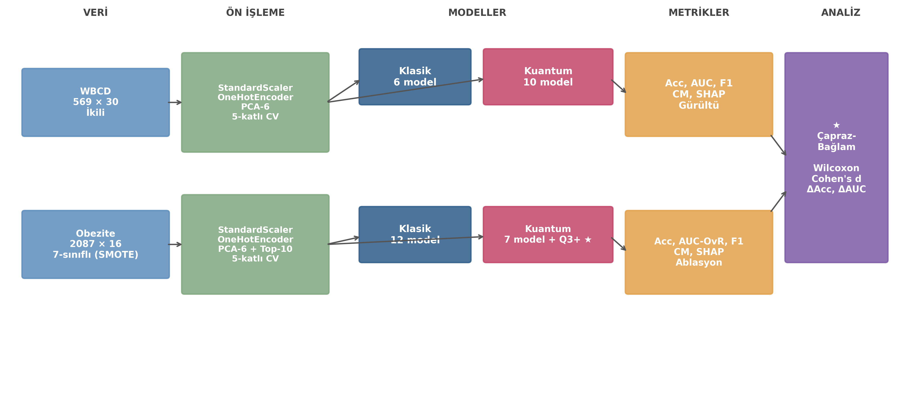

WBCD ve Obezite veri setlerinin paralel değerlendirme akışı — 5-katlı stratified CV altında 35 model varyantı.

#### Şekil 2 — Q-Hybrid-Q3-Plus Devre Şeması
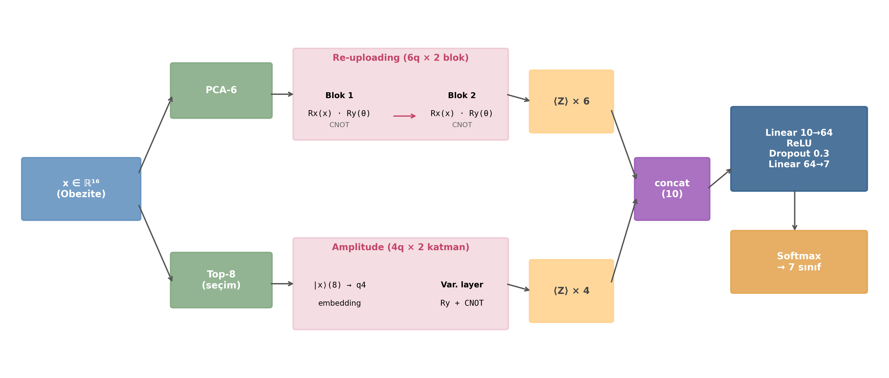

Çift-kollu kuantum-klasik hibrit yapı.

### WBCD Sonuçları

#### Şekil 3 — ROC Eğrileri
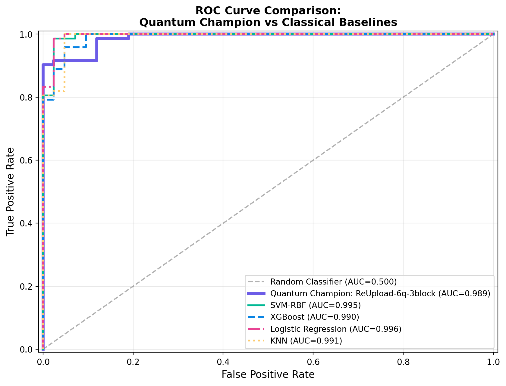

> **Drive yolu:** `MyDrive/QML_ISADES2026/gorseller/ROC_FINAL_v2_MAKALE.png`

#### Şekil 4 — Encoding Aile Heatmap
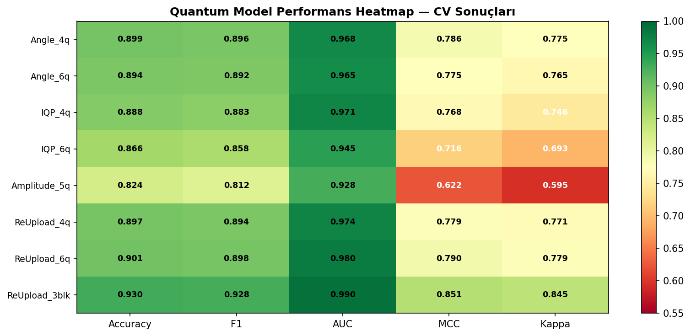

> **Drive yolu:** `MyDrive/QML_ISADES2026/gorseller/HEATMAP_Encoding_FINAL.png`

#### Şekil 5 — Kuantum Şampiyon Karışıklık Matrisi
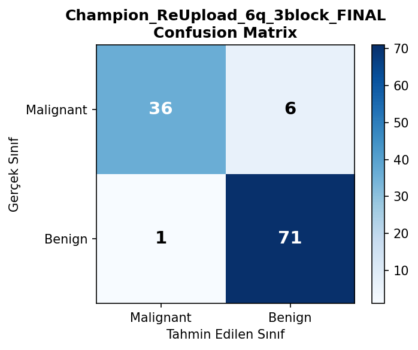

> **Drive yolu:** `MyDrive/QML_ISADES2026/gorseller/CM_Champion_ReUpload_6q_3block_FINAL.png`

#### Şekil 6 — Gürültü Robustluğu
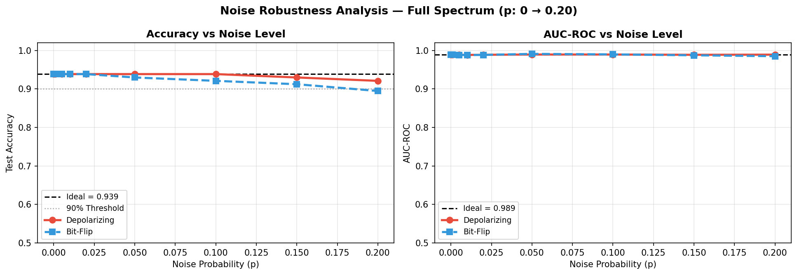

> **Drive yolu:** `MyDrive/QML_ISADES2026/gorseller/NOISE_FULL_SPECTRUM_Champion_ReUpload_6q_3block.png`

VQC ReUpload-6q-3blok modeli depolarizing p=0.20 altında %92.10, bit-flip p=0.20 altında %89.47 doğruluğunu korumaktadır.

### Obezite Sonuçları

#### Şekil 7 — Q-Hybrid-Q3-Plus Karışıklık Matrisi (7 sınıf)
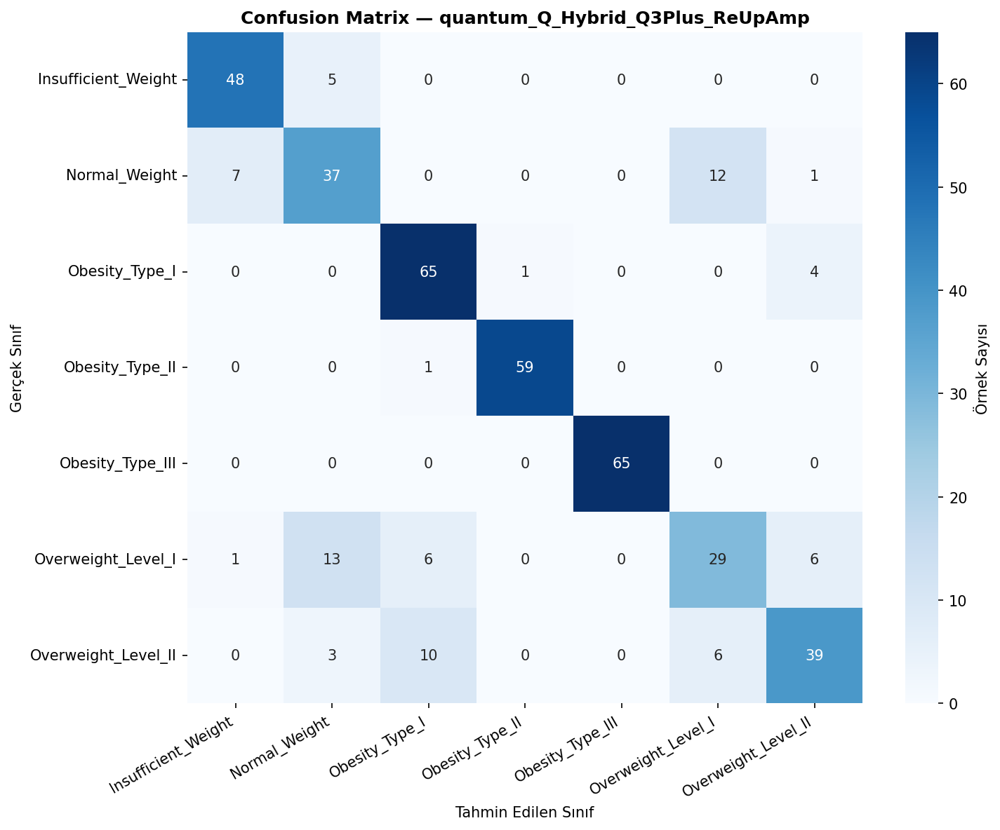

> **Drive yolu:** `MyDrive/QML_Obesity_ISADES2026/gorseller/q3plus_confusion_matrix.png`

#### Şekil 8 — Re-uploading Derinlik Ablasyonu
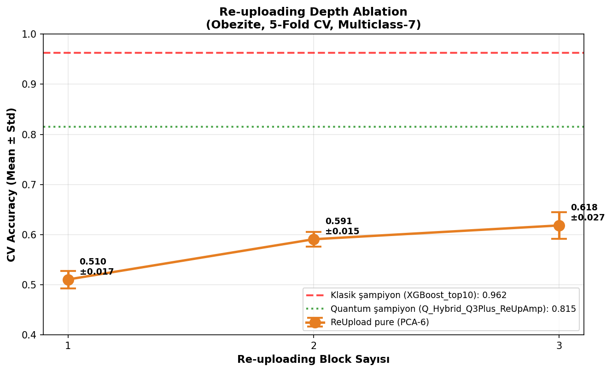

> **Drive yolu:** `MyDrive/QML_Obesity_ISADES2026/gorseller/quantum_reupload_ablation.png`

1-blok %51.05 → 2-blok %59.08 → 3-blok %61.83 — her blok yaklaşık 5 puan iyileşme.

#### Şekil 9 — Encoding Aile Karşılaştırması
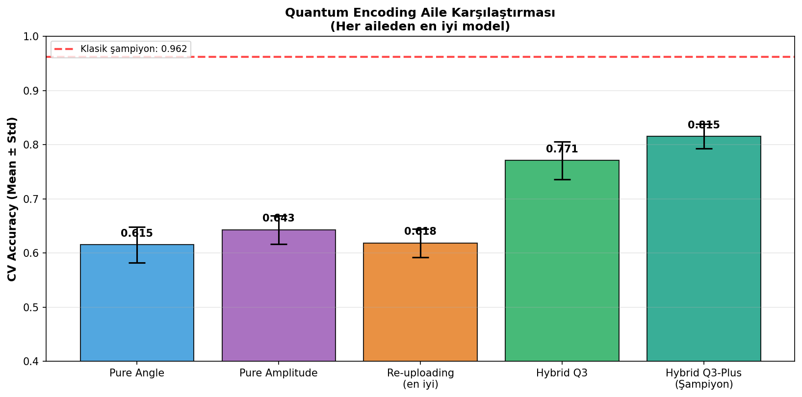

> **Drive yolu:** `MyDrive/QML_Obesity_ISADES2026/gorseller/quantum_aile_karsilastirma.png`

Saf kodlamaların %61-64 tavanı, hibrit Q3-Plus ile %81.54'e yükseliyor (+19.7 puan hibrit avantajı).

#### Şekil 10 — Tüm Kuantum Modeller
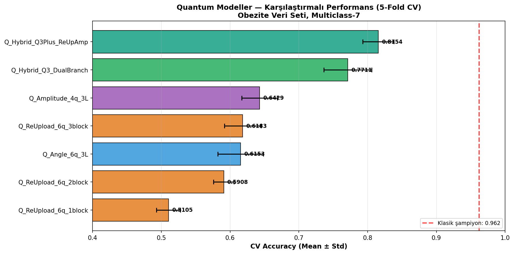

> **Drive yolu:** `MyDrive/QML_Obesity_ISADES2026/gorseller/quantum_karsilastirma_bar.png`

### Çapraz-Bağlam Analizi

#### Şekil 11 — 4-Panel Çapraz-Bağlam Açıklığı (Anahtar Görsel )


#### Şekil 12 — Wilcoxon Fold-Bazlı Karşılaştırma
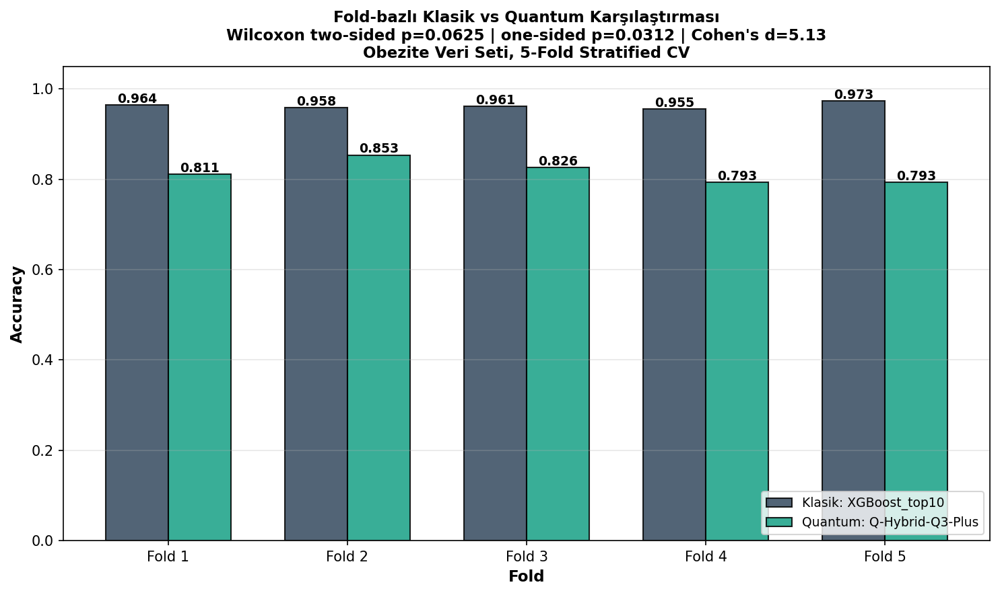

> **Drive yolu:** `MyDrive/QML_Obesity_ISADES2026/gorseller/wilcoxon_fold_karsilastirma.png`

### Açıklanabilirlik (SHAP)

#### Şekil 13 — XGBoost SHAP İlk Üç Sürücü
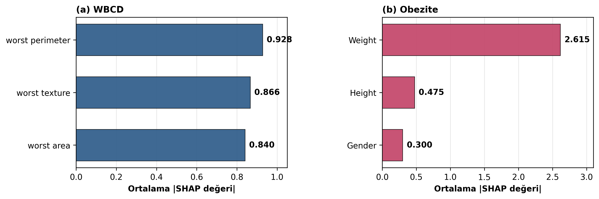

| Veri seti | İlk 3 sürücü | SHAP değerleri |
|-----------|--------------|:--------------:|
| **WBCD** | worst perimeter, worst texture, worst area | 0.928, 0.866, 0.840 |
| **Obezite** | Weight, Height, Gender | 2.615, 0.475, 0.300 |

---

##  Sonuçlar

### Tablo I — WBCD: Tüm Modellerin 5-Katlı CV Sonuçları

| Model | Tür | CV Acc | Acc Std | F1 | AUC | Param |
|-------|:---:|:------:|:-------:|:--:|:---:|:-----:|
| **SVM-RBF** | Kl. | **0.9802** | 0.0044 | **0.9802** | **0.9947** | 200 SV |
| LR | Kl. | 0.9736 | 0.0054 | 0.9735 | 0.9947 | 31 |
| XGBoost | Kl. | 0.9736 | 0.0112 | 0.9735 | 0.9954 | ~10K |
| RF | Kl. | 0.9604 | 0.0149 | 0.9604 | 0.9908 | ~25K |
| KNN | Kl. | 0.9714 | 0.0149 | 0.9713 | 0.9929 | — |
| MLP | Kl. | 0.9385 | 0.0365 | 0.9385 | 0.9851 | ~40K |
| **VQC ReUpload-6q-3blok** | Q. | **0.9297** | 0.0292 | **0.9284** | **0.9898** | **54** |
| VQC ReUpload-6q | Q. | 0.9011 | 0.0374 | 0.8978 | 0.9804 | 36 |
| VQC ReUpload-4q | Q. | 0.8967 | 0.0330 | 0.8941 | 0.9735 | 24 |
| VQC IQP-4q | Q. | 0.8879 | 0.0213 | 0.8829 | 0.9714 | 24 |
| VQC Angle-4q | Q. | 0.8989 | 0.0189 | 0.8961 | 0.9677 | 24 |
| VQC Angle-6q | Q. | 0.8945 | 0.0226 | 0.8916 | 0.9648 | 36 |
| VQC IQP-6q | Q. | 0.8659 | 0.0566 | 0.8577 | 0.9454 | 36 |
| VQC Amplitude-5q | Q. | 0.8242 | 0.0547 | 0.8124 | 0.9282 | 30 |
| QKernel-SVM-4q | Q. | 0.8308 | 0.0226 | 0.8285 | 0.9047 | kernel |
| QKernel-SVM-6q | Q. | 0.7692 | 0.0184 | 0.7599 | 0.8609 | kernel |

### Tablo II — Obezite: Tüm Modellerin 5-Katlı CV Sonuçları (özet)

| Model | Tür | CV Acc | AUC | F1 |
|-------|:---:|:------:|:---:|:--:|
| **XGBoost-Top10** | Kl. | **0.9623 ± 0.0061** | **0.9971** | **0.9611** |
| SVM-RBF-Top10 | Kl. | 0.9521 ± 0.0104 | 0.9975 | 0.9498 |
| LR-Top10 | Kl. | 0.9431 ± 0.0093 | 0.9960 | 0.9405 |
| RF-Top10 | Kl. | 0.9395 ± 0.0106 | 0.9947 | 0.9373 |
| MLP-Top10 | Kl. | 0.9221 ± 0.0179 | 0.9947 | 0.9180 |
| **Q-Hybrid-Q3-Plus**  | Q. | **0.8154 ± 0.0227** | **0.9663** | **0.8073** |
| Q-Hybrid-Q3 (DualBranch) | Q. | 0.7711 ± 0.0347 | 0.9530 | 0.7581 |
| Q-Amplitude-4q-3L | Q. | 0.6429 ± 0.0260 | 0.9050 | 0.6283 |
| Q-ReUpload-6q-3blok | Q. | 0.6183 ± 0.0266 | 0.8845 | 0.5939 |
| Q-Angle-6q-3L | Q. | 0.6153 ± 0.0330 | 0.8838 | 0.5875 |
| Q-ReUpload-6q-2blok | Q. | 0.5908 ± 0.0150 | 0.8801 | 0.5619 |
| Q-ReUpload-6q-1blok | Q. | 0.5105 ± 0.0174 | 0.8314 | 0.4697 |

### Tablo III — Çapraz-Bağlam Karşılaştırma Özeti

| Boyut | WBCD | Obezite |
|-------|:----:|:-------:|
| Sınıf sayısı | 2 (binary) | 7 (multiclass) |
| Veri kaynağı | %100 gerçek | %77 SMOTE |
| Klasik şampiyon | SVM-RBF | XGBoost-Top10 |
| Kuantum şampiyon | VQC ReUpload-6q-3blok | Q-Hybrid-Q3-Plus |
| Doğruluk farkı | **5.05 puan** | **14.68 puan** |
| AUC farkı | 0.0049 | 0.0308 |
| Cohen's d (eşli) | 1.70 (büyük) | 5.13 (çok büyük) |
| Wilcoxon p (tek-yönlü) | 0.0312* | 0.0312* |

---

## 📝 Atıf

Bu çalışmayı kullanıyorsanız lütfen aşağıdaki şekilde atıfta bulunun:

```bibtex
@inproceedings{qml_health_isades2026,
  title     = {Sağlık Verileri Üzerinde Klasik--Kuantum Makine Öğrenmesi: Çapraz-Bağlam Karşılaştırmalı Bir Çalışma},
  author    = {Tevfik Metin, Atakan Yılmaz, Enes Furkan Kaya, Emine Gülmez, Assoc. Prof. Dr. Muhammet Baykara*},
  booktitle = {ISADES 2026 -- International Symposium on Applied Data Engineering and Sciences},
  year      = {2026},
  address   = {Uganda},
  publisher = {ISADES}
}
```

> **Not:** Tam atıf bilgisi makalenin kabul edilmesinin ardından güncellenecektir.

---

##  Yazarlar

- **[Tevfik Metin]** — *[birim, e-posta]*
- **[Atakan Yılmaz]** — *[birim, e-posta]*
- **[Enes Furkan Kaya]** — *[birim, e-posta]*
- **[Emine Gülmez]** — *[birim, e-posta]*
- **[Muhammet Baykara]** — Danışman — *[birim, e-posta]*

**Kurum:** Fırat Üniversitesi, Teknoloji Fakültesi, Yazılım Mühendisliği, Elazığ, Türkiye

---

##  Katkıda Bulunma

Bu repo bir akademik çalışmanın deneylerini barındırmaktadır. Hata bildirimleri ve sorular için [Issues](../../issues) bölümünü kullanabilirsiniz.

---

##  Lisans

Bu proje **MIT Lisansı** altında dağıtılmaktadır — detaylar için [LICENSE](LICENSE) dosyasına bakınız.

> Veri setleri kendi orijinal lisansları altında kullanılmaktadır:
> - WBCD: UCI Machine Learning Repository (CC BY 4.0)
> - Obezite: Data in Brief (CC BY 4.0)

---


<div align="center">

** Bu repo size yararlı olduysa yıldızlamayı unutmayın!**

[](../../stargazers)

</div>
